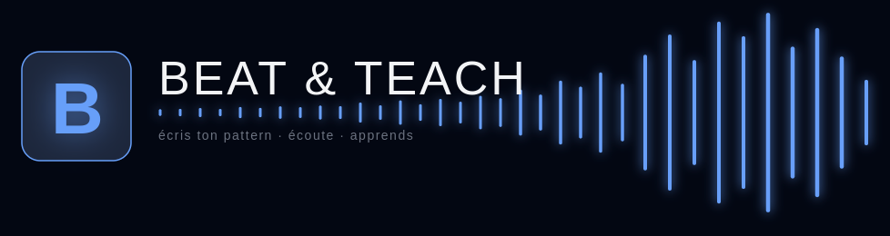

<br>

<p align="center">
  <strong>Beat & Teach</strong> — une application de composition musicale rythmique assistée, destinée à l'apprentissage du beatbox.
</p>

<br>

---

<br>

## ✦ Présentation

**Beat & Teach** transforme la notation rythmique en un langage symbolique simple et visuel. Chaque symbole — `P`, `Ts`, `K`, `Bw`, `Lo` — représente un son. Composez des séquences, superposez des pistes, associez vos propres samples, et écoutez le résultat en temps réel.

L'outil idéal pour les beatboxers, musiciens et enseignants qui veulent noter, apprendre et partager des patterns rythmiques.

<br>

## ✦ Fonctionnalités

|                                         |                                                                                                              |
| --------------------------------------- | ------------------------------------------------------------------------------------------------------------ |
| **🎵 Notation symbolique**        | Écrivez vos rythmes avec un langage textuel intuitif :`P Ts (K . P) Ts K .`                               |
| **🎛️ Séquenceur multi-pistes** | Superposez plusieurs lignes rythmiques avec visualisation en grille temps réel                              |
| **🔊 Lecture temps réel**        | Moteur audio basé sur Tone.js — boucle synchronisée, step callback pour l'UI                              |
| **🎚️ Banque d'instruments**     | 20 instruments préchargés, import de vos propres sons, mapping symbole → sample                           |
| **📦 Bibliothèque .beatpack**    | Exportez et importez vos patterns et instruments dans un format portable                                     |
| **🎓 Visites guidées**           | Tours interactifs driver.js pour une prise en main immédiate (Studio, Instruments, Patterns, Bibliothèque) |

<br>

## ✦ Stack technique

```
Electron · React · TypeScript · Tone.js · Tailwind CSS · SQLite (better-sqlite3)
Webpack · Jest · Electron Builder · driver.js · Lucide Icons · adm-zip
```

<br>

## ✦ Démarrer

```bash
# Cloner le dépôt
git clone https://github.com/Drasenix/beat-and-teach-it.git
cd beat-and-teach-it

# Installer les dépendances
npm install

# Lancer le développement
npm start
```

<br>

## ✦ Développement

```bash
npm start          # Dev complet (webpack + electronmon)
npm run test       # Tests Jest (TDD pour le code métier)
npm run lint       # ESLint — vérification du code
npm run build      # Build production
npm run package    # Package desktop (electron-builder)
```

<br>

## ✦ Premiers pas

1. Lancez l'application avec `npm start`
2. Dirigez-vous vers le **Studio** (`/workspace`)
3. Sélectionnez un pattern existant ou créez-en un nouveau
4. Tapez des symboles dans les pistes : `P Ts K . P (Ts P) K`
5. Appuyez sur **Play** (Ctrl+Enter) pour écouter
6. Explorez la **Configuration des instruments** pour personnaliser les sons
7. Utilisez la **Bibliothèque** pour exporter et partager vos créations

<br>

## ✦ Raccourcis clavier

| Touche                | Action                     |
| --------------------- | -------------------------- |
| `F1`                | Aide — raccourcis         |
| `Ctrl + Enter`      | Play / Stop                |
| `Ctrl + ↑`         | BPM +1                     |
| `Ctrl + ↓`         | BPM -1                     |
| `↑` / `↓`       | Navigation autocomplétion |
| `Space` / `Enter` | Valider suggestion         |
| `Ctrl + Espace`     | Afficher/Masquer autocomp  |
| `Escape`            | Fermer modale              |

<br>

## ✦ Démo

> 🎥 _Une capture d'écran ou un screencast du studio en action sera bientôt disponible ici._

<br>

## ✦ Licence

MIT © Beat & Teach
